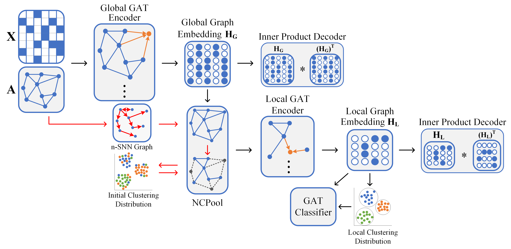

# DGEN-TNNLS-2022
This repo contains the demo code and data of our IEEE TNNLS'2022 paper Seeing All From a Few: Nodes Selection Using Graph Pooling for Graph Clustering

>IEEE Xplore: [Seeing All From a Few: Nodes Selection Using Graph Pooling for Graph Clustering](https://ieeexplore.ieee.org/document/9913735/)
>


## Requirements

pytorch>=1.12.0 

numpy>=1.23.1

munkres>=1.1.4

scikit-learn>=1.1.2

torch-geometric>=2.1.0

## Reference
If you find our work useful in your research, please consider citing:

```latex
@ARTICLE{9913735,
  author={Wang, Yiming and Chang, Dongxia and Fu, Zhiqiang and Zhao, Yao},
  journal={IEEE Transactions on Neural Networks and Learning Systems}, 
  title={Seeing All From a Few: Nodes Selection Using Graph Pooling for Graph Clustering}, 
  year={2022},
  doi={10.1109/TNNLS.2022.3210370}}
